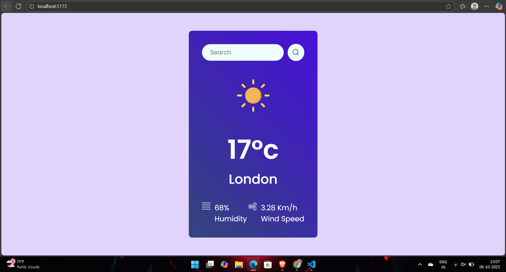

# 🌤️ WeatherApp — React + Vite Weather App


A **real-time weather forecast app** built using **React**, **Vite**, and the **OpenWeather API**.  
Check live temperature, humidity, and weather conditions for any city across the globe — in an elegant, responsive design ☁️✨  

---

## 📌 Table of Contents
- [Demo](#-demo)
- [Features](#-features)
- [Tech Stack](#-tech-stack)
- [How to Run](#-how-to-run-locally)
- [API Setup](#-api-setup)
- [About Me](#-about-me)
- [Connect with Me](#-connect-with-me)

---

## 🚀 Demo


🔗 [Live Demo](https://adarshj61.github.io/WeatherNow/)  
*(Replace this with your actual deployment link once live)*  

---

## ✨ Features
- 🌍 Search weather by **city name**  
- ☀️ Shows temperature, humidity, wind speed & condition  
- 🌈 Dynamic icons and background based on weather  
- ⚡ Built with **React + Vite** for high performance  
- 📱 Fully **responsive design** for mobile and desktop  
- 💡 Simple, modern, and beginner-friendly UI  

---

## 🛠️ Tech Stack
- ⚛️ **React.js** — Component-based frontend library  
- ⚡ **Vite** — Superfast development environment  
- 🌦️ **OpenWeather API** — Real-time weather data  
- 🎨 **CSS** — For styling (use whichever applies)  

---

## 🚦 How to Run Locally

Follow these steps to run the project on your local machine:

```bash
# Clone the repository
git clone https://github.com/adarshj61/WeatherNow.git

# Move into the project folder
cd WeatherNow

# Install dependencies
npm install

# Run the app
npm run dev

```
---

## 🔑 API Setup

1. Go to [OpenWeather](https://openweathermap.org/api) and sign up for a free account.  
2. Generate your **API key** after verifying your email.  
3. Create a `.env` file in your project’s root folder and add the following line:
   ```bash
   VITE_APP_ID=your_api_key_here

## ⚠️ Disclaimer

This project is built for educational purposes using publicly available data from OpenWeather
.
It has no affiliation with any official weather organizations.

## 👨‍💻 About Me
I'm learning web development and this was my first frontend project.
I enjoy building UI projects to improve my skills and practice responsive design.


## Let's Connect! 🤝
I’m open to collaboration, freelance opportunities, or just a chat about tech. Reach me here:

<p align="left" style="display: flex; gap: 10px; flex-wrap: wrap;">
  <a href="https://www.linkedin.com/in/adarsh-jaiswal-78a266353" target="_blank" style="text-decoration:none;">
    
  </a>
 <a href="https://github.com/adarshj61" target="_blank">
  
</a>

  <a href="mailto:aj941545@gmail.com" style="text-decoration:none;">
    
  </a>
  <a href="" target="_blank" style="text-decoration:none;">
    
  </a>
</p>

